# DOCUMENTACIÓN TÉCNICA - Chatbot GOMARCO
## Guía Completa para Desarrolladores Externos

<div align="center">
  <h3>🛏️ Descansa como te mereces - GOMARCO</h3>
  <p><strong>Asistente de Inteligencia Artificial Corporativo</strong></p>
  
  [](https://dotnet.microsoft.com/download/dotnet/8.0)
  []()
  []()
  []()
</div>

> **📁 IMPORTANTE - RUTAS RELATIVAS**: Este documento utiliza rutas relativas `../chatbot/` para referenciar archivos del proyecto. Estas rutas asumen que la documentación está ubicada un nivel por encima del directorio `chatbot`. Si ubicas este README en otro lugar, ajusta las rutas según corresponda.

---

## 📋 ÍNDICE

1. [Arquitectura del Sistema](#arquitectura-del-sistema)
2. [Motor de IA Interno](#motor-de-ia-interno)
3. [Sistema de Seguridad y Cifrado](#sistema-de-seguridad-y-cifrado)
4. [Almacenamiento y Persistencia](#almacenamiento-y-persistencia)
5. [Análisis de Contenido de Archivos](#análisis-de-contenido-de-archivos)
6. [Flujo de Datos y Conectividad](#flujo-de-datos-y-conectividad)
7. [Guía de Modificaciones](#guía-de-modificaciones)
8. [API y Servicios](#api-y-servicios)
9. [Consideraciones de Despliegue](#consideraciones-de-despliegue)
10. [Solución de Problemas Técnicos](#solución-de-problemas-técnicos)

---

## 🏗️ ARQUITECTURA DEL SISTEMA

### Patrón MVVM con Inyección de Dependencias

```mermaid
graph TB
    subgraph "PRESENTACIÓN (WPF)"
        V[VentanaPrincipal.xaml] --> VM[ViewModeloVentanaPrincipal]
    end
    
    subgraph "SERVICIOS DE NEGOCIO"
        SC[ServicioChatbot] --> SA[ServicioArchivos]
        SC --> SE[ServicioExtraccionContenido]
        SA --> SCR[ServicioCifrado]
        SC --> SH[ServicioHistorialChats]
    end
    
    subgraph "ACCESO A DATOS"
        CB[ContextoBaseDatos<br/>Entity Framework]
    end
    
    subgraph "PERSISTENCIA"
        DB[(SQLite Database<br/>chatbot.db)]
        FILES[Archivos Cifrados<br/>AES-256]
        TEMP[Archivos Temporales<br/>Descifrados]
    end
    
    VM --> SC
    SH --> CB
    SA --> CB
    CB --> DB
    SA --> FILES
    SA --> TEMP
    SCR --> FILES
```



### Stack Tecnológico

| **Componente** | **Tecnología** | **Versión** | **Propósito** |
|----------------|---------------|-------------|---------------|
| **Framework** | .NET | 8.0 | Runtime y BCL |
| **UI** | WPF | 8.0 | Interfaz gráfica nativa |
| **MVVM** | CommunityToolkit.Mvvm | 8.2.2 | Patrón arquitectónico |
| **ORM** | Entity Framework Core | 8.0.0 | Mapeo objeto-relacional |
| **Base de Datos** | SQLite | 8.0.0 | Persistencia local |
| **Cifrado** | System.Security.Cryptography | Nativo | AES-256, SHA-256 |
| **DI Container** | Microsoft.Extensions.DependencyInjection | 8.0.0 | Inversión de control |
| **Logging** | Microsoft.Extensions.Logging | 8.0.0 | Sistema de logs |
| **PDF** | iText7 | 8.0.2 | Extracción de texto PDF |
| **Office** | DocumentFormat.OpenXml | 3.0.1 | Documentos .docx, .xlsx, .pptx |
| **Multimedia** | MetadataExtractor | 2.8.1 | Metadatos de imágenes/videos |
| **Compresión** | SharpCompress | 0.34.2 | Archivos comprimidos |

---

## 🤖 MOTOR DE IA INTERNO

### ⚠️ IMPORTANTE: NO HAY API EXTERNA

El chatbot **NO utiliza APIs externas** como OpenAI, Google AI o Azure Cognitive Services. Todo el procesamiento es **100% local** y **offline**.

### Sistema de Inteligencia Simulada

#### Ubicación: `../chatbot/Servicios/ServicioChatbot.cs`

```csharp
public class ServicioChatbot : IServicioChatbot
{
    // Respuestas predeterminadas categorizadas
    private readonly List<string> _respuestasSaludo = new()
    {
        "¡Hola! Soy el asistente de IA de GOMARCO...",
        // ... más respuestas
    };

    private readonly Dictionary<string, List<string>> _respuestasTematicas = new()
    {
        ["colchon"] = new() { /* respuestas sobre colchones */ },
        ["documento"] = new() { /* respuestas sobre documentos */ },
        ["ayuda"] = new() { /* respuestas de ayuda */ }
    };
}
```

#### Algoritmos de Procesamiento

1. **Detección de Intención (Pattern Matching)**:
```csharp
private bool EsSaludo(string mensaje)
{
    var saludos = new[] { "hola", "hello", "hi", "buenos", "buenas" };
    return saludos.Any(s => mensaje.ToLowerInvariant().Contains(s));
}
```

2. **Análisis Contextual**:
```csharp
public async Task<string> ProcesarMensajeAsync(string mensaje, string idSesion, 
    List<ArchivoSubido>? archivosContexto = null)
{
    // 1. Analizar archivos de contexto
    if (archivosContexto?.Any() == true)
    {
        // Detectar consultas específicas sobre archivos
        var archivoEspecifico = DetectarConsultaArchivoEspecifico(mensaje, archivosContexto);
        
        // Generar respuesta contextual basada en contenido real
        return await GenerarRespuestaConContextoInteligente(mensaje, archivosContexto);
    }
    
    // 2. Detección de temas por palabras clave
    foreach (var tema in _respuestasTematicas.Keys)
    {
        if (mensaje.ToLowerInvariant().Contains(tema))
        {
            return ObtenerRespuestaAleatoria(tema);
        }
    }
}
```

3. **Generación de Respuestas Inteligentes**:
```csharp
private string GenerarResumenInteligente(string contenido, string tipoContenido)
{
    var palabras = contenido.Split(' ', StringSplitOptions.RemoveEmptyEntries);
    var lineas = contenido.Split('\n', StringSplitOptions.RemoveEmptyEntries);
    
    // Análisis específico por tipo de archivo
    switch (tipoContenido)
    {
        case "application/pdf":
            return GenerarResumenPdf(contenido, resumen);
        case "application/json":
            return GenerarResumenJson(contenido, resumen);
        // ... otros tipos
    }
}
```

### Extracción de Temas Principales

```csharp
private List<string> ExtraerTemasPrincipales(string contenido)
{
    var palabrasComunes = new HashSet<string> { 
        "el", "la", "de", "que", "y", "a", "en" // Stop words
    };
    
    return Regex.Matches(contenido.ToLowerInvariant(), @"\b[a-záéíóúñü]{4,}\b")
        .Cast<Match>()
        .Select(m => m.Value)
        .Where(p => !palabrasComunes.Contains(p))
        .GroupBy(p => p)
        .Where(g => g.Count() >= 3) // Aparecer al menos 3 veces
        .OrderByDescending(g => g.Count())
        .Take(5)
        .Select(g => CapitalizeFirst(g.Key))
        .ToList();
}
```

---

## 🔐 SISTEMA DE SEGURIDAD Y CIFRADO

### Cifrado AES-256 con Modo CBC

#### Ubicación: `../chatbot/Servicios/ServicioCifrado.cs`

```csharp
public class ServicioCifrado : IServicioCifrado
{
    private readonly byte[] _claveMaestra;
    
    public ServicioCifrado(ILogger<ServicioCifrado> logger)
    {
        _claveMaestra = GenerarClaveCifrado(); // Clave única por máquina
    }
}
```

### Especificaciones Técnicas de Cifrado

| **Algoritmo** | **AES (Advanced Encryption Standard)** |
|---------------|----------------------------------------|
| **Tamaño de Clave** | 256 bits |
| **Modo de Operación** | CBC (Cipher Block Chaining) |
| **Relleno** | PKCS7 |
| **Vector de Inicialización** | Aleatorio de 128 bits por archivo |
| **Hash de Integridad** | SHA-256 |

### Generación de Claves Única por Máquina

```csharp
public byte[] GenerarClaveCifrado()
{
    var nombreMaquina = Environment.MachineName;     // DESKTOP-ABC123
    var nombreUsuario = Environment.UserName;       // irene
    var datosUnicos = $"GOMARCO-{nombreMaquina}-{nombreUsuario}-CHATBOT-2025";
    
    using var sha256 = SHA256.Create();
    return sha256.ComputeHash(Encoding.UTF8.GetBytes(datosUnicos));
    // Resultado: clave de 32 bytes (256 bits) determinística pero única
}
```

### Proceso de Cifrado de Archivos

```csharp
public async Task<string> CifrarArchivoAsync(string rutaArchivoOriginal, string rutaArchivoCifrado)
{
    using var aes = Aes.Create();
    aes.Key = _claveMaestra;           // Clave fija por máquina
    aes.GenerateIV();                  // IV aleatorio por archivo
    
    var vectorInicializacion = Convert.ToBase64String(aes.IV);
    
    using var streamOriginal = File.OpenRead(rutaArchivoOriginal);
    using var streamCifrado = File.Create(rutaArchivoCifrado);
    using var cifrador = aes.CreateEncryptor();
    using var cryptoStream = new CryptoStream(streamCifrado, cifrador, CryptoStreamMode.Write);
    
    await streamOriginal.CopyToAsync(cryptoStream);
    
    return vectorInicializacion; // Se almacena en DB para descifrado
}
```

### Verificación de Integridad

```csharp
public async Task<string> CalcularHashArchivoAsync(string rutaArchivo)
{
    using var sha256 = SHA256.Create();
    using var stream = File.OpenRead(rutaArchivo);
    var hash = await Task.Run(() => sha256.ComputeHash(stream));
    return Convert.ToHexString(hash); // Hex string de 64 caracteres
}
```

### Ubicaciones Seguras de Almacenamiento

```csharp
// Archivos cifrados permanentes
private static readonly string DirectorioArchivosCifrados = Path.Combine(
    Environment.GetFolderPath(Environment.SpecialFolder.ApplicationData), // %APPDATA%
    "GOMARCO", "ChatbotGomarco", "ArchivosSegurosCifrados"
);

// Archivos temporales descifrados (se eliminan automáticamente)
private static readonly string DirectorioArchivosTemporales = Path.Combine(
    Path.GetTempPath(),              // %TEMP%
    "ChatbotGomarco", "ArchivosTemporales"
);
```

---

## 🗄️ ALMACENAMIENTO Y PERSISTENCIA

### Base de Datos SQLite

#### Ubicación: `%APPDATA%\GOMARCO\ChatbotGomarco\chatbot.db`

#### Schema de Base de Datos

```sql
-- Sesiones de chat
CREATE TABLE SesionesChat (
    Id TEXT PRIMARY KEY,
    Titulo TEXT(200) NOT NULL,
    FechaCreacion DATETIME NOT NULL,
    FechaUltimaActividad DATETIME NOT NULL,
    CantidadMensajes INTEGER NOT NULL DEFAULT 0,
    CantidadArchivos INTEGER NOT NULL DEFAULT 0
);

-- Mensajes individuales
CREATE TABLE MensajesChat (
    Id INTEGER PRIMARY KEY AUTOINCREMENT,
    IdSesionChat TEXT NOT NULL,
    Contenido TEXT(10000) NOT NULL,
    TipoMensaje INTEGER NOT NULL, -- 0=Usuario, 1=Asistente, 2=Sistema
    FechaCreacion DATETIME NOT NULL,
    ArchivoAdjuntoRuta TEXT(1000),
    NombreArchivoAdjunto TEXT(500),
    EsArchivoCifrado BOOLEAN NOT NULL DEFAULT 0,
    FOREIGN KEY (IdSesionChat) REFERENCES SesionesChat(Id) ON DELETE CASCADE
);

-- Metadatos de archivos cifrados
CREATE TABLE ArchivosSubidos (
    Id INTEGER PRIMARY KEY AUTOINCREMENT,
    IdSesionChat TEXT NOT NULL,
    NombreOriginal TEXT(500) NOT NULL,
    RutaArchivoCifrado TEXT(1000) NOT NULL, -- Ruta al archivo .enc
    HashSha256 TEXT(64) NOT NULL,           -- Hash del archivo original
    TamañoOriginal BIGINT NOT NULL,
    FechaSubida DATETIME NOT NULL,
    TipoContenido TEXT(100) NOT NULL,       -- MIME type
    Descripcion TEXT(1000),
    VectorInicializacion TEXT(500) NOT NULL, -- IV para descifrar
    EstaCifrado BOOLEAN NOT NULL DEFAULT 1,
    FOREIGN KEY (IdSesionChat) REFERENCES SesionesChat(Id) ON DELETE CASCADE
);
```

#### Configuración Entity Framework

```csharp
// ../chatbot/Datos/ContextoBaseDatos.cs
protected override void OnConfiguring(DbContextOptionsBuilder optionsBuilder)
{
    var rutaDB = Path.Combine(
        Environment.GetFolderPath(Environment.SpecialFolder.ApplicationData),
        "GOMARCO", "ChatbotGomarco", "chatbot.db"
    );
    
    optionsBuilder
        .UseSqlite($"Data Source={rutaDB}")
        .EnableSensitiveDataLogging(false); // Seguridad
}
```

### Estructura de Archivos

```
%APPDATA%\GOMARCO\ChatbotGomarco\
├── chatbot.db                          # Base de datos SQLite
├── ArchivosSegurosCifrados\            # Archivos cifrados permanentes
│   ├── 550e8400-e29b-41d4-a716-446655440000.enc
│   ├── 6ba7b810-9dad-11d1-80b4-00c04fd430c8.enc
│   └── ...
├── Logs\                               # Sistema de logging
│   ├── chatbot-20241201.log
│   └── errors.log
└── Config\                             # Configuraciones locales
    └── user-preferences.json

%TEMP%\ChatbotGomarco\ArchivosTemporales\
├── temp_550e8400_documento.pdf         # Archivos temporales descifrados
└── temp_6ba7b810_imagen.jpg            # Se eliminan automáticamente
```

---

## 📄 ANÁLISIS DE CONTENIDO DE ARCHIVOS

### Tipos de Archivo Soportados (1GB máximo)

#### Ubicación: `../chatbot/Servicios/ServicioExtraccionContenido.cs`

```csharp
private readonly HashSet<string> _tiposCompatibles = new()
{
    // Documentos
    "application/pdf",
    "application/msword",
    "application/vnd.openxmlformats-officedocument.wordprocessingml.document",
    "application/vnd.ms-excel",
    "application/vnd.openxmlformats-officedocument.spreadsheetml.sheet",
    
    // Texto y datos
    "text/plain", "text/csv", "application/json", "application/xml",
    
    // Imágenes
    "image/jpeg", "image/png", "image/gif", "image/bmp", "image/svg+xml",
    "image/webp", "image/tiff",
    
    // Audio/Video
    "audio/mpeg", "audio/wav", "audio/aac", "video/mp4", "video/avi",
    
    // Comprimidos
    "application/zip", "application/x-rar-compressed", "application/x-7z-compressed"
};
```

### Librerías de Extracción Especializadas

| **Tipo de Archivo** | **Librería** | **Funcionalidad** |
|-------------------|-------------|-------------------|
| **PDF** | `iText7` | Extracción completa de texto, metadatos, estructura |
| **Word/Excel/PowerPoint** | `DocumentFormat.OpenXml` | Análisis de documentos Office modernos |
| **Imágenes/Videos** | `MetadataExtractor` | Metadatos EXIF, dimensiones, información técnica |
| **Comprimidos** | `SharpCompress` | Listado de contenido, extracción de archivos |
| **General** | `System.Drawing.Common` | Propiedades básicas de imagen |

### Proceso de Extracción de Contenido

```csharp
public async Task<string> ExtraerTextoAsync(string rutaArchivo, string tipoContenido)
{
    return tipoContenido switch
    {
        "application/pdf" => await ExtraerTextoPdfAsync(rutaArchivo),
        "application/vnd.openxmlformats-officedocument.wordprocessingml.document" 
            => await ExtraerTextoWordAsync(rutaArchivo),
        "application/json" => await ExtraerTextoJsonAsync(rutaArchivo),
        "text/csv" => await ExtraerTextoCsvAsync(rutaArchivo),
        "image/svg+xml" => await ExtraerTextoSvgAsync(rutaArchivo),
        "application/zip" => await ExtraerTextoArchivoComprimidoAsync(rutaArchivo),
        // ... más casos
    };
}
```

#### Ejemplo: Extracción de PDF

```csharp
private async Task<string> ExtraerTextoPdfAsync(string rutaArchivo)
{
    var contenido = new StringBuilder();
    
    using var reader = new PdfReader(rutaArchivo);
    using var document = new PdfDocument(reader);
    
    for (int i = 1; i <= document.GetNumberOfPages(); i++)
    {
        var page = document.GetPage(i);
        var text = PdfTextExtractor.GetTextFromPage(page);
        
        if (!string.IsNullOrWhiteSpace(text))
        {
            contenido.AppendLine($"=== PÁGINA {i} ===");
            contenido.AppendLine(text.Trim());
            contenido.AppendLine();
        }
    }
    
    return contenido.ToString();
}
```

#### Ejemplo: Análisis de Metadatos de Imagen

```csharp
private async Task<DocumentoMetadatos> ExtraerMetadatosImagenAsync(string rutaArchivo)
{
    var metadatos = new DocumentoMetadatos { TipoDocumento = "Imagen" };
    
    var directories = ImageMetadataReader.ReadMetadata(rutaArchivo);
    
    foreach (var directory in directories)
    {
        foreach (var tag in directory.Tags)
        {
            if (tag.HasName && !string.IsNullOrEmpty(tag.Description))
            {
                metadatos.PropiedadesPersonalizadas[tag.Name] = tag.Description;
            }
        }
    }
    
    // Información básica de imagen
    using var image = Image.FromFile(rutaArchivo);
    metadatos.PropiedadesPersonalizadas["Dimensiones"] = $"{image.Width}x{image.Height}";
    metadatos.PropiedadesPersonalizadas["Formato"] = image.RawFormat.ToString();
    
    return metadatos;
}
```

---

## 🔄 FLUJO DE DATOS Y CONECTIVIDAD

### ⚠️ SISTEMA 100% OFFLINE

- **NO requiere conexión a Internet**
- **NO utiliza APIs externas**
- **NO envía datos a servidores remotos**
- **Todos los datos permanecen en la máquina local**

### Flujo de Procesamiento de Archivos


### Servicios y Sus Responsabilidades

| **Servicio** | **Responsabilidad** | **Archivo** |
|-------------|-------------------|-------------|
| **ServicioChatbot** | Lógica de IA, procesamiento de mensajes | `../chatbot/Servicios/ServicioChatbot.cs` |
| **ServicioArchivos** | Gestión de archivos, cifrado/descifrado | `../chatbot/Servicios/ServicioArchivos.cs` |
| **ServicioCifrado** | Algoritmos de cifrado AES-256, hashing | `../chatbot/Servicios/ServicioCifrado.cs` |
| **ServicioExtraccionContenido** | Análisis y extracción de contenido | `../chatbot/Servicios/ServicioExtraccionContenido.cs` |
| **ServicioHistorialChats** | Persistencia de conversaciones | `../chatbot/Servicios/ServicioHistorialChats.cs` |

---

## 🔧 GUÍA DE MODIFICACIONES

### Para Cambiar el Motor de IA

#### Archivo: `../chatbot/Servicios/ServicioChatbot.cs`

**1. Para añadir nuevos tipos de respuesta:**
```csharp
// Línea ~20-30: Añadir nuevas categorías
private readonly Dictionary<string, List<string>> _respuestasTematicas = new()
{
    ["nueva_categoria"] = new()
    {
        "Respuesta para nueva categoría 1",
        "Respuesta para nueva categoría 2"
    }
};
```

**2. Para integrar API externa (OpenAI, Azure AI):**
```csharp
// Añadir al constructor
public ServicioChatbot(/* ... */, IHttpClientFactory httpClientFactory)
{
    _httpClient = httpClientFactory.CreateClient();
}

// Modificar método principal
public async Task<string> ProcesarMensajeAsync(string mensaje, string idSesion, 
    List<ArchivoSubido>? archivosContexto = null)
{
    // Para usar API externa:
    if (Configuration.UseExternalAI)
    {
        return await ProcesarConAPIExterna(mensaje, archivosContexto);
    }
    
    // Mantener lógica local como fallback
    return ProcesarConIALocal(mensaje, archivosContexto);
}
```

### Para Añadir Nuevos Tipos de Archivo

#### Archivo: `../chatbot/Servicios/ServicioExtraccionContenido.cs`

**1. Actualizar tipos compatibles:**
```csharp
// Línea ~27: Añadir MIME type
private readonly HashSet<string> _tiposCompatibles = new()
{
    "application/vnd.nuevo-formato", // Nuevo tipo
    // ... existentes
};
```

**2. Implementar método de extracción:**
```csharp
// Línea ~80: Añadir caso en switch
public async Task<string> ExtraerTextoAsync(string rutaArchivo, string tipoContenido)
{
    return tipoContenido switch
    {
        "application/vnd.nuevo-formato" => await ExtraerTextoNuevoFormatoAsync(rutaArchivo),
        // ... existentes
    };
}

// Implementar método específico
private async Task<string> ExtraerTextoNuevoFormatoAsync(string rutaArchivo)
{
    // Lógica de extracción específica
    return contenidoExtraido;
}
```

### Para Modificar Límites de Archivo

#### Archivo: `../chatbot/Servicios/ServicioChatbot.cs`

```csharp
// Línea ~400: Cambiar límite de tamaño
public async Task<bool> ValidarSeguridadArchivoAsync(string rutaArchivo)
{
    var tamañoMaximo = 1024L * 1024 * 1024; // Cambiar aquí (1GB actual)
    
    var infoArchivo = new FileInfo(rutaArchivo);
    if (infoArchivo.Length > tamañoMaximo)
    {
        return false;
    }
    
    // Actualizar también las extensiones permitidas
    var extensionesPermitidas = new[] 
    {
        ".pdf", ".doc", ".docx", ".nueva_extension" // Añadir aquí
    };
}
```

### Para Cambiar Algoritmo de Cifrado

#### Archivo: `../chatbot/Servicios/ServicioCifrado.cs`

**⚠️ CUIDADO: Cambiar el cifrado hará inaccesibles archivos existentes**

```csharp
// Para cambiar de AES-256 a otro algoritmo
public async Task<string> CifrarArchivoAsync(string rutaArchivoOriginal, string rutaArchivoCifrado)
{
    // Reemplazar AES con otro algoritmo
    using var algoritmo = ChaCha20.Create(); // Ejemplo: ChaCha20
    // using var aes = Aes.Create(); // Actual
    
    // Resto del código similar
}
```

### Comandos de Desarrollo

#### Compilar y ejecutar desde directorio `chatbot`:
```bash
# Navegar al directorio del proyecto
cd chatbot

# Restaurar dependencias
dotnet restore

# Compilar
dotnet build -c Release

# Ejecutar
dotnet run
# O ejecutar el .exe directamente:
.\bin\Release\net8.0-windows\ChatbotGomarco.exe
```

### Para Modificar Base de Datos

#### Archivo: `../chatbot/Datos/ContextoBaseDatos.cs`

**1. Añadir nueva tabla:**
```csharp
public DbSet<NuevaEntidad> NuevasEntidades { get; set; }

protected override void OnModelCreating(ModelBuilder modelBuilder)
{
    // Configuración nueva entidad
    modelBuilder.Entity<NuevaEntidad>(entidad =>
    {
        entidad.HasKey(n => n.Id);
        entidad.Property(n => n.Propiedad).HasMaxLength(200);
    });
}
```

**2. Migrar base de datos:**
```bash
# En consola de desarrollo
dotnet ef migrations add AgregarNuevaEntidad
dotnet ef database update
```

### Para Añadir Logging Personalizado

#### Archivo: `App.xaml.cs`

```csharp
private void ConfigurarServicios()
{
    servicios.AddLogging(constructor => 
    {
        constructor.SetMinimumLevel(LogLevel.Information);
        constructor.AddConsole(); // Para desarrollo
        constructor.AddFile("Logs/chatbot-{Date}.log"); // Personalizado
        
        // Para logging remoto
        constructor.AddEventLog(new EventLogSettings
        {
            SourceName = "ChatbotGomarco",
            LogName = "Application"
        });
    });
}
```

---

## 🌐 API Y SERVICIOS

### Interfaces de Servicios Principales

#### IServicioChatbot
```csharp
public interface IServicioChatbot
{
    Task<string> ProcesarMensajeAsync(string mensaje, string idSesion, 
        List<ArchivoSubido>? archivosContexto = null);
    Task<string> AnalizarArchivoAsync(ArchivoSubido archivo);
    Task<string> GenerarTituloConversacionAsync(string primerMensaje);
    Task<bool> ValidarSeguridadArchivoAsync(string rutaArchivo);
    Task<List<string>> GenerarSugerenciasAsync(List<MensajeChat> contextoConversacion);
}
```

#### IServicioArchivos
```csharp
public interface IServicioArchivos
{
    Task<ArchivoSubido> SubirArchivoAsync(string rutaArchivo, string idSesionChat, 
        string? descripcion = null);
    Task<List<ArchivoSubido>> ObtenerArchivosSesionAsync(string idSesionChat);
    Task EliminarArchivoAsync(int idArchivo);
    Task<string> DescargarArchivoTemporalAsync(int idArchivo);
    Task<bool> VerificarIntegridadArchivoAsync(int idArchivo);
}
```

#### IServicioExtraccionContenido
```csharp
public interface IServicioExtraccionContenido
{
    Task<string> ExtraerTextoAsync(string rutaArchivo, string tipoContenido);
    Task<DocumentoMetadatos> ExtraerMetadatosAsync(string rutaArchivo, string tipoContenido);
    Task<DocumentoEstructura> AnalizarEstructuraAsync(string rutaArchivo, string tipoContenido);
    bool EsTipoCompatible(string tipoContenido);
}
```

### Modelos de Datos

#### ArchivoSubido
```csharp
public class ArchivoSubido
{
    public int Id { get; set; }
    public string IdSesionChat { get; set; }
    public string NombreOriginal { get; set; }
    public string RutaArchivoCifrado { get; set; }        // Archivo .enc
    public string HashSha256 { get; set; }               // Integridad
    public long TamañoOriginal { get; set; }
    public DateTime FechaSubida { get; set; }
    public string TipoContenido { get; set; }             // MIME type
    public string VectorInicializacion { get; set; }     // Para descifrar
    public bool EstaCifrado { get; set; } = true;
}
```

#### DocumentoMetadatos
```csharp
public class DocumentoMetadatos
{
    public string TipoDocumento { get; set; }
    public string? Autor { get; set; }
    public DateTime? FechaCreacion { get; set; }
    public DateTime? FechaModificacion { get; set; }
    public string? Titulo { get; set; }
    public string? Asunto { get; set; }
    public Dictionary<string, string> PropiedadesPersonalizadas { get; set; } = new();
}
```

---

## 🚀 CONSIDERACIONES DE DESPLIEGUE

### Requisitos del Sistema

| **Componente** | **Mínimo** | **Recomendado** |
|---------------|------------|----------------|
| **OS** | Windows 10 1909+ | Windows 11 |
| **RAM** | 4 GB | 8 GB |
| **Almacenamiento** | 500 MB | 2 GB SSD |
| **Procesador** | Intel i3 / AMD equiv. | Intel i5+ |
| **.NET Runtime** | 8.0.0 | Última versión |

### Script de Instalación Silenciosa

```batch
@echo off
REM Instalacion/InstalarSilencioso.bat

echo Instalando Chatbot GOMARCO...

REM Verificar .NET Runtime
dotnet --list-runtimes | findstr "Microsoft.WindowsDesktop.App 8.0" >nul
if errorlevel 1 (
    echo Instalando .NET 8 Desktop Runtime...
    winget install Microsoft.DotNet.DesktopRuntime.8
)

REM Crear directorios
mkdir "%ProgramFiles%\GOMARCO\ChatbotGomarco" 2>nul
mkdir "%APPDATA%\GOMARCO\ChatbotGomarco" 2>nul

REM Copiar archivos (ejecutar desde directorio padre de chatbot)
xcopy /E /Y ".\chatbot\*" "%ProgramFiles%\GOMARCO\ChatbotGomarco\"

REM Configurar permisos
icacls "%ProgramFiles%\GOMARCO\ChatbotGomarco" /grant Users:(OI)(CI)M

REM Crear acceso directo
powershell "$WshShell = New-Object -comObject WScript.Shell; $Shortcut = $WshShell.CreateShortcut('%USERPROFILE%\Desktop\Chatbot GOMARCO.lnk'); $Shortcut.TargetPath = '%ProgramFiles%\GOMARCO\ChatbotGomarco\ChatbotGomarco.exe'; $Shortcut.Save()"

echo Instalacion completada exitosamente.
```

### Configuración de Antivirus Corporativo

```xml
<!-- AntivirusExclusions.xml -->
<PolicyExclusions>
  <Folders>
    <Path>C:\Program Files\GOMARCO\ChatbotGomarco\</Path>
    <Path>%APPDATA%\GOMARCO\ChatbotGomarco\</Path>
    <Path>%TEMP%\ChatbotGomarco\</Path>
  </Folders>
  
  <Processes>
    <Process>ChatbotGomarco.exe</Process>
    <Process>dotnet.exe</Process>
  </Processes>
  
  <Extensions>
    <Extension>.enc</Extension>
    <Extension>.db</Extension>
  </Extensions>
</PolicyExclusions>
```

### Configuración de Grupo de Políticas

```reg
Windows Registry Editor Version 5.00

; HKEY_LOCAL_MACHINE\SOFTWARE\Policies\GOMARCO\ChatbotGomarco
[HKLM\SOFTWARE\Policies\GOMARCO\ChatbotGomarco]
"MaxFileSize"=dword:40000000          ; 1GB en bytes
"AllowedFileTypes"="pdf,docx,xlsx,jpg,png"
"LogLevel"="Information"
"DataRetentionDays"=dword:0000005a    ; 90 días
"AutoCleanTemp"=dword:00000001
```

---

## 🛠️ SOLUCIÓN DE PROBLEMAS TÉCNICOS

### Diagnóstico de Problemas Comunes

#### 1. Error de Cifrado/Descifrado

**Síntomas:** "No se puede descifrar el archivo" o "Hash no coincide"
**Causa:** Archivo corrupto o clave diferente
**Solución:**
```csharp
// En ServicioArchivos.cs, añadir validación
public async Task<string> DescargarArchivoTemporalAsync(int idArchivo)
{
    var archivo = await _contexto.ArchivosSubidos.FindAsync(idArchivo);
    
    // Verificar integridad ANTES de descifrar
    if (!File.Exists(archivo.RutaArchivoCifrado))
        throw new FileNotFoundException("Archivo cifrado no encontrado");
        
    try 
    {
        await _servicioCifrado.DescifrarArchivoAsync(/* ... */);
    }
    catch (CryptographicException ex)
    {
        _logger.LogError("Error de descifrado: {Error}", ex.Message);
        throw new InvalidOperationException("Archivo dañado o clave incorrecta");
    }
}
```

#### 2. Base de Datos Bloqueada

**Síntomas:** "Database is locked" o timeout en operaciones
**Causa:** Múltiples procesos accediendo SQLite
**Solución:**
```csharp
// En ContextoBaseDatos.cs
protected override void OnConfiguring(DbContextOptionsBuilder optionsBuilder)
{
    optionsBuilder.UseSqlite(connectionString, options =>
    {
        options.CommandTimeout(30); // 30 segundos timeout
    });
    
    // Configurar connection string con timeout
    var connectionString = $"Data Source={rutaDB};Pooling=true;Connection Timeout=30";
}
```

#### 3. Memoria Insuficiente con Archivos Grandes

**Síntomas:** OutOfMemoryException al procesar archivos
**Causa:** Archivos muy grandes cargados en memoria
**Solución:**
```csharp
// En ServicioExtraccionContenido.cs, procesar por chunks
private async Task<string> ExtraerTextoPdfAsync(string rutaArchivo)
{
    var contenido = new StringBuilder();
    const int BATCH_SIZE = 10; // Procesar 10 páginas a la vez
    
    using var reader = new PdfReader(rutaArchivo);
    using var document = new PdfDocument(reader);
    
    for (int i = 1; i <= document.GetNumberOfPages(); i += BATCH_SIZE)
    {
        var endPage = Math.Min(i + BATCH_SIZE - 1, document.GetNumberOfPages());
        
        for (int page = i; page <= endPage; page++)
        {
            var text = PdfTextExtractor.GetTextFromPage(document.GetPage(page));
            contenido.AppendLine(text);
        }
        
        // Liberar memoria periódicamente
        GC.Collect();
        GC.WaitForPendingFinalizers();
    }
    
    return contenido.ToString();
}
```

#### 4. Depuración de Logs

**Ubicación de logs:** `%APPDATA%\GOMARCO\ChatbotGomarco\Logs\`

**Configurar nivel de log detallado:**
```csharp
// En App.xaml.cs para debugging
services.AddLogging(builder =>
{
    builder.SetMinimumLevel(LogLevel.Trace); // Muy detallado
    builder.AddConsole();
    builder.AddFile("Logs/debug-{Date}.log");
});
```

### Herramientas de Diagnóstico

#### Script PowerShell de Diagnóstico

```powershell
# DiagnosticoChatbot.ps1
param(
    [switch]$Full = $false
)

Write-Host "=== DIAGNÓSTICO CHATBOT GOMARCO ===" -ForegroundColor Green

# Verificar .NET Runtime
Write-Host "`n1. Verificando .NET Runtime..."
$dotnetRuntimes = dotnet --list-runtimes | Select-String "Microsoft.WindowsDesktop.App 8.0"
if ($dotnetRuntimes) {
    Write-Host "✓ .NET 8 Desktop Runtime encontrado" -ForegroundColor Green
} else {
    Write-Host "✗ .NET 8 Desktop Runtime NO encontrado" -ForegroundColor Red
}

# Verificar archivos de aplicación
Write-Host "`n2. Verificando archivos de aplicación..."
$appPath = "$env:ProgramFiles\GOMARCO\ChatbotGomarco\ChatbotGomarco.exe"
if (Test-Path $appPath) {
    $version = (Get-ItemProperty $appPath).VersionInfo.FileVersion
    Write-Host "✓ Aplicación encontrada - Versión: $version" -ForegroundColor Green
} else {
    Write-Host "✗ Archivo de aplicación NO encontrado en $appPath" -ForegroundColor Red
}

# Verificar base de datos
Write-Host "`n3. Verificando base de datos..."
$dbPath = "$env:APPDATA\GOMARCO\ChatbotGomarco\chatbot.db"
if (Test-Path $dbPath) {
    $dbSize = (Get-Item $dbPath).Length
    Write-Host "✓ Base de datos encontrada - Tamaño: $([math]::Round($dbSize/1MB, 2)) MB" -ForegroundColor Green
} else {
    Write-Host "✗ Base de datos NO encontrada" -ForegroundColor Red
}

# Verificar logs recientes
Write-Host "`n4. Verificando logs..."
$logsPath = "$env:APPDATA\GOMARCO\ChatbotGomarco\Logs"
if (Test-Path $logsPath) {
    $recentLogs = Get-ChildItem $logsPath -Filter "*.log" | Where-Object {$_.LastWriteTime -gt (Get-Date).AddDays(-1)}
    Write-Host "✓ Encontrados $($recentLogs.Count) logs recientes" -ForegroundColor Green
    
    if ($Full) {
        Write-Host "`nÚltimas 10 líneas de error:"
        Get-Content "$logsPath\errors.log" -Tail 10 -ErrorAction SilentlyContinue
    }
} else {
    Write-Host "✗ Directorio de logs NO encontrado" -ForegroundColor Red
}

# Verificar espacio en disco
Write-Host "`n5. Verificando espacio en disco..."
$drive = Get-WmiObject -Class Win32_LogicalDisk -Filter "DeviceID='C:'"
$freeSpaceGB = [math]::Round($drive.FreeSpace / 1GB, 2)
if ($freeSpaceGB -gt 1) {
    Write-Host "✓ Espacio libre: $freeSpaceGB GB" -ForegroundColor Green
} else {
    Write-Host "⚠ Espacio libre bajo: $freeSpaceGB GB" -ForegroundColor Yellow
}

Write-Host "`n=== FIN DIAGNÓSTICO ===" -ForegroundColor Green
```

---

## 📞 CONTACTO Y SOPORTE

### Para Desarrolladores

- **Repositorio:** (URL del repositorio Git interno)
- **Documentación técnica:** Este archivo
- **Issues/Bugs:** Sistema de tickets interno

### Información de la Versión Actual

- **Versión:** 2.0.0 (con análisis expandido de archivos)
- **Fecha compilación:** Julio 2025
- **Framework:** .NET 8.0
- **Compatibilidad:** Windows 10 1909+ / Windows 11

---

<div align="center">
  <p><strong>Desarrollado para GOMARCO</strong></p>
  <p><em>🛏️ Descansa como te mereces</em></p>
  
  **Sistema 100% Seguro • 100% Local • 100% Privado**
</div> 